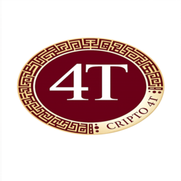

  

# Crypto 4T (4T)

Crypto 4T is a community-driven cryptocurrency deployed on the Binance Smart Chain (BSC).

The project focuses on simplicity, transparency, and decentralized trading.

## Token Information

Name: Crypto 4T  
Symbol: 4T  
Network: Binance Smart Chain (BEP-20)

Total Supply:
30,000,000,000

Contract Address:
0x86C86A84004FA803161b3444088a74809BA3b1F4

## Trading

Crypto 4T can be traded on PancakeSwap.

DEX Pair:
4T / WBNB
https://pancakeswap.finance/liquidity/pool/bsc/0x166c23036af1354C7260e1E0544EAEBa2B731c50?chainName=bsc&id=0x166c23036af1354C7260e1E0544EAEBa2B731c50&chain=bsc

## Charts

Track price and liquidity on Dexscreener.

## Official Links

Website: https://www.4tcrypto.com
https://bscscan.com/address/0x86C86A84004FA803161b3444088a74809BA3b1F4#code
https://github.com/Crypto4T/Cripto4T

Dexscreener: https://dexscreener.com/bsc/0x166c23036af1354c7260e1e0544eaeba2b731c50

## Community

More updates and community channels will be added soon.
